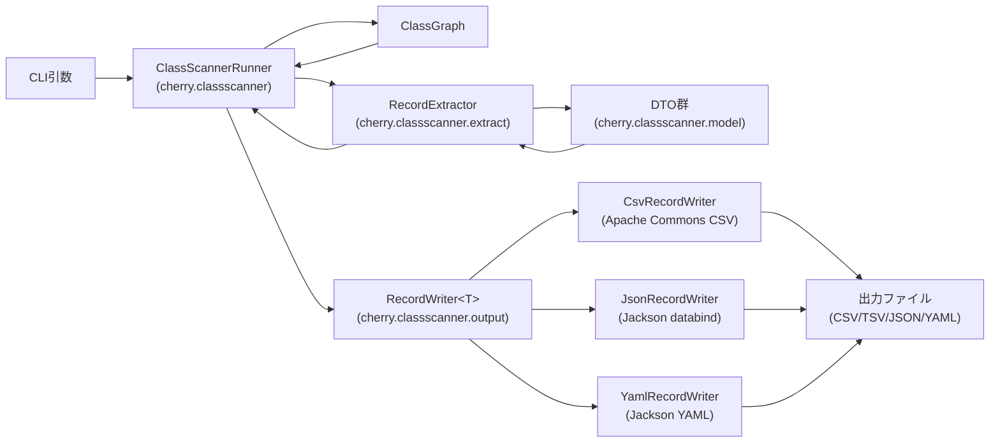

# Component Dependency

## 依存関係マトリクス

| From | To | 種別 | 理由 |
|---|---|---|---|
| `Main` | Spring Framework (`SpringApplication`) | Compile | アプリケーション起動 |
| `ClassScannerRunner` | `RecordExtractor` | Compile | スキャン結果のDTO変換を委譲 |
| `ClassScannerRunner` | `RecordWriter<T>`（インターフェース経由） | Compile | 出力処理を委譲（実装はStrategyとして`--format`値により選択） |
| `ClassScannerRunner` | ClassGraph | Compile | クラスファイルの静的スキャン |
| `RecordExtractor` | `cherry.classscanner.model`（DTO群） | Compile | 抽出結果の格納先 |
| `RecordExtractor` | ClassGraph | Compile | `ClassInfo`/`MethodInfo`/`FieldInfo`/`ConstructorInfo`からの変換元 |
| `CsvRecordWriter` | `cherry.classscanner.model`（DTO群） | Compile | 書式化対象 |
| `CsvRecordWriter` | Apache Commons CSV | Compile | CSV/TSV出力（既存依存を継続利用） |
| `JsonRecordWriter` | `cherry.classscanner.model`（DTO群） | Compile | 書式化対象 |
| `JsonRecordWriter` | Jackson（`jackson-databind`） | Compile | JSON出力（新規依存、NFR-2） |
| `YamlRecordWriter` | `cherry.classscanner.model`（DTO群） | Compile | 書式化対象 |
| `YamlRecordWriter` | Jackson（`jackson-dataformat-yaml`） | Compile | YAML出力（新規依存、NFR-2） |

## コミュニケーションパターン
- 全ての依存は同一JVM内・同一モジュール内の直接メソッド呼び出し（プロセス間通信やネットワーク呼び出しは存在しない）。
- `ClassScannerRunner`から`RecordWriter<T>`への依存は、具体実装ではなくインターフェース経由（Strategyパターン、`--format`値に基づき実行時に実装を選択）。これにより新フォーマット追加時は新しい`RecordWriter`実装を追加するだけで済み、`ClassScannerRunner`側の変更を最小化できる。
- `cherry.classscanner.model`（DTO）は`extract`層と`output`層の両方から参照される共有コンポーネントだが、DTO自身はどちらのパッケージにも依存しない（単方向依存）。

## データフロー図

