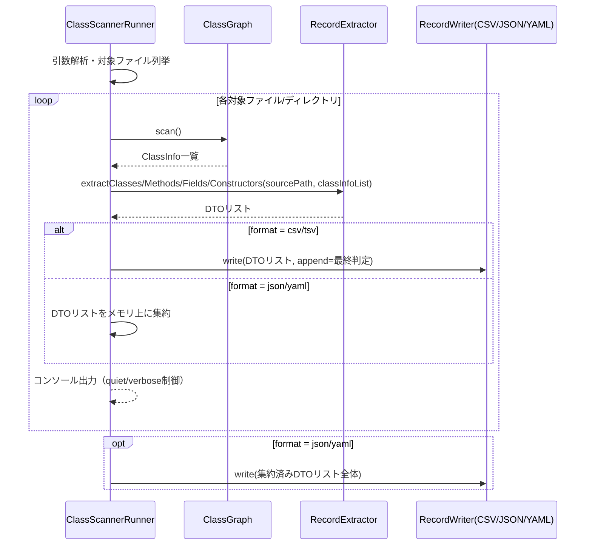

# Services

**Note**: 本プロジェクトは単一プロセスのCLIツールであり、独立デプロイされる「サービス」は存在しない。ここでは`ClassScannerRunner`が担うオーケストレーション（サービス層相当）の責務と処理順序を定義する（承認済み: Application Design Question 5 = A）。

## オーケストレーションサービス: `ClassScannerRunner`

### 責務
1. コマンドライン引数の解釈（対象ファイル/ディレクトリ、`--verbose`, `--package`, `--*-output`, `--format`, `--charset`, `--quiet`）
2. 対象ファイル/ディレクトリの存在確認・列挙（既存の`findProcessableFiles`を踏襲）
3. 各対象に対しClassGraphスキャンを実行（既存の`processFile`相当のループを踏襲）
4. スキャン結果を`RecordExtractor`へ渡してDTOへ変換
5. `--format`の値に応じて適切な`RecordWriter`実装を選択（Strategyパターン、既存の`getCSVFormat`/`getCharset`のようなswitch式による選択ロジックを踏襲）
6. 書式に応じた出力タイミング制御:
   - **CSV/TSV**: 対象ファイルを処理するたびに逐次`RecordWriter.write(..., append)`を呼び出す（1ファイル目はヘッダーあり・新規、2ファイル目以降はヘッダーなし・追記）。既存のCSV/TSV出力挙動を完全に踏襲する。
   - **JSON/YAML**: 全対象ファイルの処理が完了するまでDTOをメモリ上に集約し、最後に1回だけ`RecordWriter.write(...)`を呼び出す（`append`は使用しない）。
7. コンソール出力（標準/`--verbose`）— 既存の`printVerboseClassInfo`相当（修飾子・クラスアノテーション表示を追加、FR-6）
8. 終了コードの管理（既存通り: 0=正常、1=`IOException`発生時）

### 処理フロー（概要）

### 設計上の注意点
- 具体的なメソッド分割・実装詳細はConstruction PhaseのFunctional Designで確定する。

> **改訂（Code Generation完了後）**: 上記6.のCSV/TSVとJSON/YAMLの書き込みタイミングの非対称性は、Code Generation完了後にユーザー判断で解消された。既存のCSV/TSV逐次書き込み挙動との互換性よりコードのシンプルさを優先し、全フォーマットが「全対象処理後に集約リストを1回だけ書き込む」という単一モデルに統一されている。詳細は`functional-design/business-rules.md` BR-8/BR-9改訂を参照。
