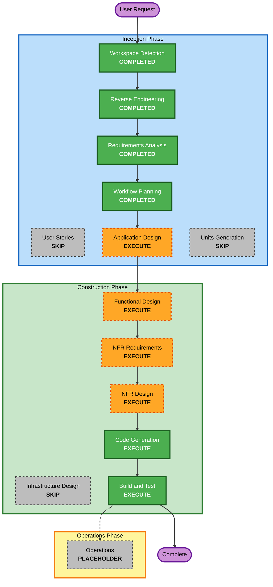

# Execution Plan

## Detailed Analysis Summary

### Transformation Scope (Brownfield)
- **Transformation Type**: Single component change（既存の単一Gradleモジュール内での機能拡張・内部リファクタリング。アーキテクチャ変革やデプロイモデル変更は伴わない）
- **Primary Changes**: `cherry.classscanner`パッケージへのDTO層・書式化(Writer)層の新設、CLI引数体系の拡張・リネーム、テストスイートの新規整備
- **Related Components**: なし（単一パッケージ・単一モジュール構成のため、影響は`cherry.classscanner`パッケージ内に閉じる）

### Change Impact Assessment
- **User-facing changes**: Yes — 新規CLIオプション(`--classes-output`)、フォーマット追加(`json`/`yaml`)、既存オプションのリネーム(`--methods-csv`等→`--methods-output`等、旧名は廃止)、`--verbose`出力への項目追加
- **Structural changes**: Yes — `ClassScannerRunner`の責務を「抽出(ClassGraph→DTO)」と「書式化(DTO→出力)」に分離
- **Data model changes**: Yes — 新規DTO（`ClassRecord`, `MethodRecord`, `FieldRecord`, `ConstructorRecord`等）を新設
- **API changes**: Yes（CLIオプションが事実上の外部インターフェース）— 破壊的変更あり（旧`*-csv`オプション廃止、後方互換なし）
- **NFR impact**: Minor — 新規依存追加（Jackson、jqwik）のみ。性能・セキュリティ・スケーラビリティ要件の新規発生なし

### Component Relationships
- **Primary Component**: `cherry.classscanner`（CLIアプリケーション本体）
- **Infrastructure Components**: なし
- **Shared Components**: なし
- **Dependent Components**: なし（他サービスからの呼び出しがない単体CLI）
- **Supporting Components**: なし

### Risk Assessment
- **Risk Level**: Low〜Medium（本番稼働中の外部利用者や他システム連携がなく影響範囲は限定的。一方でCLIオプションの破壊的変更と内部構造の分離を伴うため、単純なバグ修正よりは複雑）
- **Rollback Complexity**: Easy（単一リポジトリ、Gitで容易に切り戻し可能）
- **Testing Complexity**: Moderate（新規テストスイート整備 + Partial PBT導入のため一定の設計・検証コストがある）

## Workflow Visualization



### Text Alternative

```
INCEPTION PHASE
- Workspace Detection ......... COMPLETED
- Reverse Engineering ......... COMPLETED
- Requirements Analysis ....... COMPLETED
- User Stories ................ SKIP
- Workflow Planning ........... COMPLETED
- Application Design .......... EXECUTE
- Units Generation ............ SKIP

CONSTRUCTION PHASE (Per-Unit Loop, 1 unit: java-class-scanner本体)
- Functional Design ........... EXECUTE
- NFR Requirements ............ EXECUTE
- NFR Design ................... EXECUTE
- Infrastructure Design ....... SKIP
- Code Generation .............. EXECUTE (ALWAYS)
- Build and Test ............... EXECUTE (ALWAYS)

OPERATIONS PHASE
- Operations ................... PLACEHOLDER
```

## Phases to Execute

### Inception Phase
- [x] Workspace Detection (COMPLETED)
- [x] Reverse Engineering (COMPLETED)
- [x] Requirements Analysis (COMPLETED)
- [x] User Stories — SKIP
  - **Rationale**: 個人/小規模利用のCLIツールで、複数ペルソナや利害関係者間の合意形成、UI/UX上のユーザージャーニーを要する変更ではない。要求はrequirements.mdのFR/NFRとして十分明確化されており、ストーリー化による付加価値が低い（`workflow-planning.md` 3.1のSkip基準「Technical debt reduction」「Internal refactoring」に該当する要素を含む）。
- [x] Workflow Planning (COMPLETED — this document)
- [ ] Application Design — EXECUTE
  - **Rationale**: NFR-1で合意済みの「抽出層(DTO)」「書式化層(Writer)」という新規コンポーネント群の責務・インターフェース・依存関係を定義する必要がある（`workflow-planning.md` 3.2の実行基準「New components or services needed」「Component dependencies need clarification」に該当）。
- [ ] Units Generation — SKIP
  - **Rationale**: 単一Gradleモジュール・単一パッケージのモノリスであり、独立デプロイ可能な複数サービスへの分割や、チーム間の並行開発調整は不要（`units-generation.md`の定義「For monoliths, the single unit represents the entire application」に基づき、システム全体を暗黙の単一ユニットとしてConstruction Phaseの Per-Unit Loop にそのまま進む）。

### Construction Phase (Per-Unit Loop — 1 unit: java-class-scanner本体)
- [ ] Functional Design — EXECUTE
  - **Rationale**: 新規DTO（`ClassRecord`等）のフィールド定義、CSV/JSON/YAML間での配列⇔デリミタ結合変換ルール、ソート順・パッケージフィルタ等の不変条件（PBT対象）といった詳細ビジネスロジックの設計が必要（`workflow-planning.md` NFR/Functional Design実行基準「New data models or schemas」「Complex business logic」に該当）。
- [ ] NFR Requirements — EXECUTE
  - **Rationale**: Jackson（`jackson-databind`, `jackson-dataformat-yaml`）およびjqwikの具体的なバージョン選定と依存追加方針の確定が必要（tech stack selection required）。性能・セキュリティ・スケーラビリティの新規要件はないため、この観点では軽量な実行となる。
- [ ] NFR Design — EXECUTE
  - **Rationale**: NFR Requirementsで選定した依存関係・バージョンをbuild.gradleへ反映する設計を確定するため（NFR Requirementsが実行される場合は連動して実行）。
- [ ] Infrastructure Design — SKIP
  - **Rationale**: クラウドリソースやデプロイ先インフラを持たないローカル実行のスタンドアロンCLIのため対象外。
- [ ] Code Generation — EXECUTE (ALWAYS)
  - **Rationale**: DTO/Writer層の実装、CLIオプションのリネーム、verbose出力拡張、およびFR-8に基づくコメント追加を含む実装作業。
- [ ] Build and Test — EXECUTE (ALWAYS)
  - **Rationale**: ビルド確認、既存機能バックフィルテスト・新機能テスト・Partial PBT（PBT-02/03/07/08/09）の実行確認が必要。

### Operations Phase
- [ ] Operations — PLACEHOLDER
  - **Rationale**: 将来のデプロイ・モニタリングworkflow用のプレースホルダー（現状未使用）。

## Package Change Sequence
該当なし（単一パッケージ・単一モジュールのため、パッケージ間の更新順序調整は不要）。

## Estimated Timeline
- **Total Phases**: 2フェーズ実施（INCEPTION残り: Application Design、CONSTRUCTION: Functional Design〜Build and Test）
- **Estimated Duration**: 見積りなし（AI-DLCによる対話的な設計・生成作業のため、人手工数ベースの時間見積りは行わない）

## Success Criteria
- **Primary Goal**: requirements.mdのFR-1〜FR-8を満たす形で、classes-output・JSON/YAML出力・オプションリネーム・verbose拡張を実装し、既存機能全体のテストと新機能テストを整備する
- **Key Deliverables**:
  - `aidlc-docs/inception/application-design/` 配下の設計成果物（components.md等）
  - Construction Phaseの各種設計・コード生成成果物
  - 更新された`build.gradle`（Jackson, jqwik追加）
  - 更新されたソースコード（DTO層、Writer層、CLIオプション、verbose出力、コメント）
  - 新規テストスイート（Example-based + Partial PBT）
  - 更新された`README.md`/`README_en.md`/`CLAUDE.local.md`（新オプション・新形式の反映）
- **Quality Gates**:
  - `./gradlew build`が成功すること
  - `./gradlew test`で新規テストスイートが全て成功すること
  - requirements.mdの全FR/NFRが実装に反映されていること
