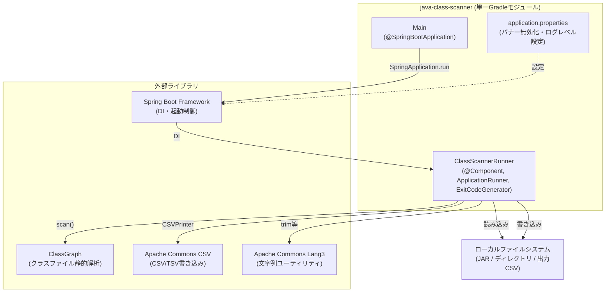
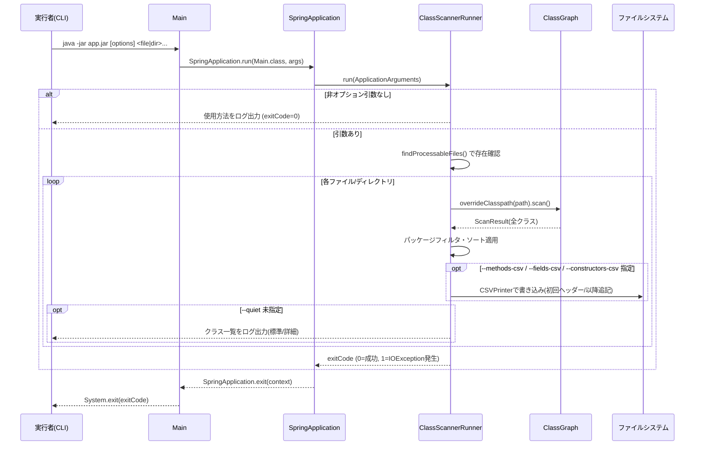

# System Architecture

## System Overview

java-class-scanner は単一モジュールのSpring Boot製コマンドラインアプリケーションである。Webサーバー機能は使用せず、`ApplicationRunner` を実装したコンポーネントがCLIとしての起動〜終了までの処理を担う。外部システムやデータベースへの接続はなく、入力はローカルファイルシステム上のJAR/クラスファイル、出力はコンソールログとローカルCSV/TSVファイルに限定される。

## Architecture Diagram

## Component Descriptions

### Main
- **Purpose**: アプリケーションのエントリポイント。
- **Responsibilities**: Spring Bootコンテキストの起動と終了、プロセス終了コードのOSへの返却。
- **Dependencies**: `spring-boot-starter`（`SpringApplication`）。
- **Type**: Application

### ClassScannerRunner
- **Purpose**: コマンドライン引数を解釈し、ClassGraphでスキャンした結果をコンソール/CSV出力する。
- **Responsibilities**: 引数解析、ファイル存在チェック、ClassGraphスキャン実行、パッケージフィルタリング、コンソール出力（標準/詳細/quiet）、CSV/TSV出力（メソッド/フィールド/コンストラクタ、ヘッダー管理付き追記）、文字コード/フォーマット解決、終了コード保持。
- **Dependencies**: `classgraph`（スキャン）、`commons-csv`（CSV出力）、`commons-lang3`（`StringUtils.trim`）、`spring-boot-starter`（`ApplicationRunner`/`ExitCodeGenerator`/`ApplicationArguments`）、`slf4j`（ロギング）。
- **Type**: Application

## Data Flow

## Integration Points

- **External APIs**: なし（外部ネットワーク通信を行わない）
- **Databases**: なし
- **Third-party Services**: なし（ライブラリ依存のみ。詳細は `dependencies.md` を参照）

## Infrastructure Components

- **CDK Stacks**: なし
- **Deployment Model**: `./gradlew bootJar` で生成した実行可能JAR (`java -jar java-class-scanner.jar`) をローカル/CI環境で直接実行する単純な配布モデル。専用のデプロイ先インフラは持たない。
- **Networking**: なし（ネットワーク通信不要のスタンドアロンCLI）
