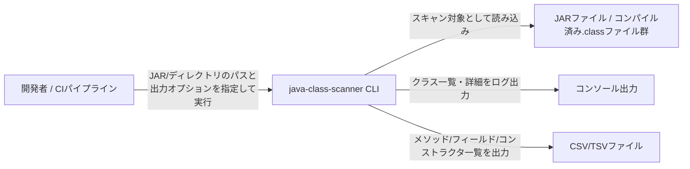

# Business Overview

## Business Context Diagram

## Business Description

- **Business Description**: java-class-scanner は、JARファイルやディレクトリ配下のJavaクラスファイルを静的にスキャンし、クラス・メソッド・フィールド・コンストラクタの構造情報（シグネチャ、修飾子、アノテーション等）を抽出してコンソールおよびCSV/TSVファイルへ出力するコマンドラインツールである。API仕様の棚卸し、リバースエンジニアリング資料作成、コードレビュー支援、依存ライブラリの提供クラス調査などの用途を想定している。
- **Business Transactions**:
  - **クラススキャン実行**: コマンドライン引数で指定されたJARファイル/ディレクトリ（複数可）を順にスキャンし、含まれる全クラスを検出する。
  - **パッケージ絞り込み**: `--package` オプションで指定したパッケージ名前方一致によりスキャン結果をフィルタリングする。
  - **標準出力表示**: 検出したクラス一覧を標準/詳細（`--verbose`）モードでログに表示する（`--quiet` で抑制可能）。
  - **CSVエクスポート（メソッド）**: `--methods-csv` 指定時、全クラスのメソッド情報（返却値・引数・修飾子・アノテーション等）をCSV/TSVへ出力する。
  - **CSVエクスポート（フィールド）**: `--fields-csv` 指定時、全クラスのフィールド情報をCSV/TSVへ出力する。
  - **CSVエクスポート（コンストラクタ）**: `--constructors-csv` 指定時、全クラスのコンストラクタ情報をCSV/TSVへ出力する。
  - **複数入力の結果集約**: 複数のJAR/ディレクトリを引数指定した場合、CSV出力はソースパス列を付与した上で1ファイルに追記集約される（先頭のみヘッダー出力）。
- **Business Dictionary**:
  - **スキャン対象 (Processable File)**: 実在するファイルまたはディレクトリとしてコマンドライン引数に渡されたパス。
  - **通常メソッド (Regular Method)**: コンストラクタ（`<init>`）・静的初期化子（`<clinit>`）・ラムダ実装メソッド（`lambda$`を含む名前）を除いた、出力対象のメソッド。
  - **ソースパス (Source Path)**: CSV出力の先頭列。そのレコードがどの入力ファイル/ディレクトリ由来かを示す。
  - **ヘッダー管理 (Header State)**: 同一実行内で同じ出力先ファイルに複数回書き込む際、初回のみヘッダー行を出力し以降は追記のみとする制御。

## Component Level Business Descriptions

### Main (エントリポイント)
- **Purpose**: Spring Bootアプリケーションの起動、および終了コードをOSへ返却する。
- **Responsibilities**: `SpringApplication.run()` によるコンテキスト起動、`SpringApplication.exit()` による終了コード取得、プロセス終了コードとしての `System.exit()` 呼び出し。

### ClassScannerRunner (アプリケーション本体)
- **Purpose**: コマンドライン引数の解釈、ClassGraphによるスキャン実行、結果のコンソール/CSV出力を担う中心的コンポーネント。
- **Responsibilities**: 引数バリデーション、ファイル/ディレクトリ列挙、パッケージフィルタ適用、コンソール出力（標準/詳細）、CSV/TSV出力（メソッド/フィールド/コンストラクタ）、文字コード・フォーマットの解決、終了コードの保持。
