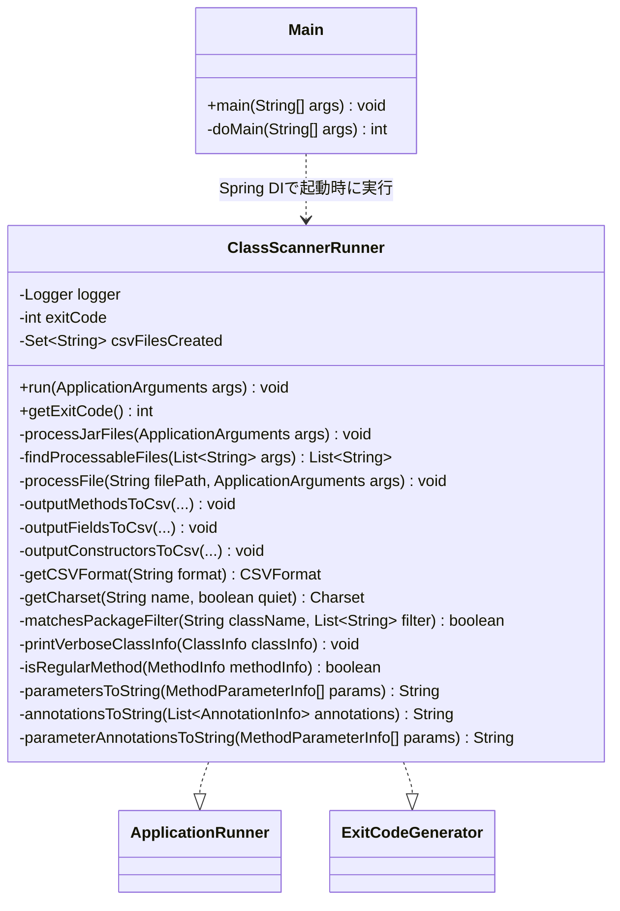

# Code Structure

## Build System

- **Type**: Gradle（Gradle Wrapper 9.6.1、`java-library` + `org.springframework.boot` 4.1.0 + `io.spring.dependency-management` プラグイン）
- **Configuration**:
  - `build.gradle`: プラグイン宣言、Javaツールチェーン（Java 25、`sourceCompatibility`/`targetCompatibility` も25）、依存管理（Spring Boot BOM 4.1.0 + `classgraph`/`commons-csv` バージョン固定）、依存宣言、`JavaCompile`のUTF-8エンコーディング設定、`Test`タスクの `useJUnitPlatform()`。
  - `settings.gradle`: `rootProject.name = 'java-class-scanner'`（単一モジュール構成）。
  - `gradle/wrapper/gradle-wrapper.properties`: Gradle 9.6.1 の配布URLを指定。

## Key Classes/Modules

### Existing Files Inventory

- `src/main/java/cherry/classscanner/Main.java` - Spring Bootエントリポイント。起動と終了コードのOSへの返却。
- `src/main/java/cherry/classscanner/ClassScannerRunner.java` - CLIの中心ロジック（引数解析、ClassGraphスキャン、コンソール/CSV出力）。
- `src/main/resources/application.properties` - バナー非表示、ログパターン（メッセージのみ）、パッケージ別ログレベル設定。
- `build.gradle` - ビルド定義（プラグイン、Java 25ツールチェーン、依存関係）。
- `settings.gradle` - ルートプロジェクト名定義。
- `gradlew` / `gradlew.bat` / `gradle/wrapper/` - Gradle Wrapper (9.6.1)。
- `README.md` / `README_en.md` - 利用者向けドキュメント（日本語/英語）。
- `CLAUDE.local.md` - 開発者/AIアシスタント向けのビルド・アーキテクチャガイド（プロジェクト固有、非バージョン管理想定）。
- `LICENSE` - Apache License 2.0。

## Design Patterns

### Command Line Runner パターン (Spring Boot `ApplicationRunner`)
- **Location**: `ClassScannerRunner`
- **Purpose**: Spring Bootの起動完了後に一度だけ実行されるCLIロジックのエントリポイントとして機能させる。
- **Implementation**: `@Component` + `ApplicationRunner#run(ApplicationArguments)` を実装し、`ExitCodeGenerator#getExitCode()` で `Main` へ終了コードを伝播する。

### ヘルパーメソッド抽出によるDRY
- **Location**: `parametersToString` / `annotationsToString` / `parameterAnnotationsToString` / `isRegularMethod` / `getCharset` / `getCSVFormat`
- **Purpose**: メソッド・フィールド・コンストラクタ出力処理間で共通する文字列変換・フィルタリングロジックの重複を排除する。
- **Implementation**: `Stream` API とメソッド参照（`MethodParameterInfo::getTypeSignatureOrTypeDescriptor` 等）を用いた小さな private ヘルパーに集約。

### 追記モードによるCSVヘッダー管理
- **Location**: `outputMethodsToCsv` / `outputFieldsToCsv` / `outputConstructorsToCsv`
- **Purpose**: 複数の入力ファイル/ディレクトリをスキャンする際、同一出力先CSVに対して1回だけヘッダーを出力し、以降はレコードのみ追記する。
- **Implementation**: `type:filename` 形式のキー（例: `methods:out.csv`）を `Set<String> csvFilesCreated` で管理し、初回書き込みかどうかを判定して `FileWriter` の `append` フラグとCSVフォーマット（ヘッダー有無）を切り替える。

## Critical Dependencies

### org.springframework.boot (Spring Boot)
- **Version**: 4.1.0（`spring-boot-dependencies` BOM経由で解決）
- **Usage**: `spring-boot-starter`（DI・起動基盤）、`ApplicationRunner`/`ExitCodeGenerator`/`ApplicationArguments`
- **Purpose**: アプリケーションのライフサイクル管理とコマンドライン引数の構造化パース。

### io.github.classgraph:classgraph
- **Version**: 4.8.184
- **Usage**: `ClassScannerRunner.processFile()` で `overrideClasspath()` + `scan()` によりJAR/ディレクトリ内のクラスをリフレクション不要で静的解析。
- **Purpose**: クラス・メソッド・フィールド・コンストラクタ・アノテーション情報の抽出。

### org.apache.commons:commons-csv
- **Version**: 1.14.1
- **Usage**: `CSVPrinter` / `CSVFormat`（`DEFAULT`/`TDF`）でCSV/TSVファイルへのレコード書き込み。
- **Purpose**: CSV/TSV出力機能の実装。

### org.apache.commons:commons-lang3
- **Version**: Spring Boot BOMが解決するバージョン（`build.gradle` にバージョン明示なし）
- **Usage**: `matchesPackageFilter()` 内の `StringUtils.trim()`
- **Purpose**: パッケージフィルタ文字列の前後空白除去。

### jakarta.annotation:jakarta.annotation-api
- **Version**: Spring Boot BOMが解決するバージョン
- **Usage**: `@Nonnull` / `@Nullable` アノテーションによるnull安全性の明示。
- **Purpose**: コードの意図表明とIDE/静的解析支援。
